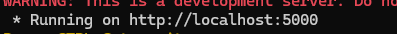

Web Stream Helper - это веб-приложение, которое позволяет пользователям настраивать и управлять действиями на их компьютере через веб-интерфейс. Приложение разработано для имитации функциональности аппаратных клавиатур Stream Deck, предоставляя пользователям гибкость и контроль над своими действиями.

Основные функции
Настройка действий: Позволяет пользователям создавать и управлять действиями, такими как комбинации клавиш или выполнение команд.
Простая интеграция: Использует популярные библиотеки Python, такие как Flask и PyAutoGUI, для обработки горячих клавиш и команд.
Безопасность: Поддерживает установку пароля для ограничения доступа к интерфейсу управления.

Как использовать
Чтобы начать использовать Web Stream Helper , настройте конфигурацию действий через интерфейс приложения. Вы можете добавлять новые действия, удалять старые и настраивать параметры, такие как комбинации клавиш или команды для выполнения.

После настройки действий вы можете взаимодействовать с приложением через главную страницу, нажимая на кнопки для выполнения действий.

## Установка

### Клонирование из репозитория

Для установки **Web Stream Helper** выполните следующие шаги:

1. Убедитесь, что у вас установлен Git. Если не установлен, [скачайте и установите Git](https://git-scm.com/downloads).

2. Клонируйте репозиторий с GitHub:

   ```bash
   git clone https://github.com/swiftmessage/WebStreamHelper.git

## Настройка программы
После установки репозитория запустите файл install.bat или же напишите команду в терминал pip install -r libers.txt
После установки библеотек  
После установки библеотке запускайте start.bat или же в терменале  python main.py

